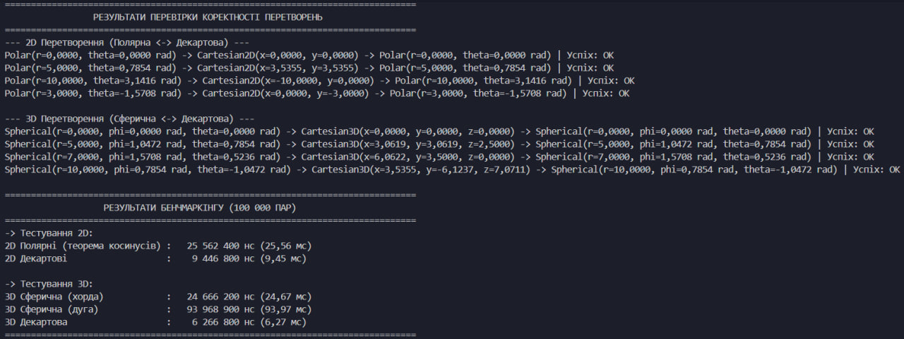

# Лабораторно-практичне заняття №1
## Програмні моделі систем координат

### 1. Короткий опис роботи

**Мета роботи:**
* Спроєктувати та реалізувати імутабельні програмні моделі для представлення геометричних точок у 2D та 3D просторах.
* Реалізувати механізми прямого та зворотного перетворення між декартовою, полярною та сферичною системами координат із застосуванням статичних фабричних методів.
* Дослідити та реалізувати обчислення відстаней між точками за різними математичними моделями (евклідова відстань, теорема косинусів, пряма відстань хорди та дугова відстань великого кола).
* Провести експериментальний порівняльний аналіз продуктивності (бенчмаркінг) обчислень для різних представлень координатних даних.

**Опис реалізованих класів:**
* `model.CartesianPoint2D` — незмінний (immutable) клас для представлення точки у 2D декартовій системі $(x, y)$. Містить статичний фабричний метод `fromPolar(PolarPoint p)` для переходу з полярних координат.
* `model.PolarPoint` — незмінний клас для представлення точки у полярній системі $(r, \theta)$ у радіанах. Реалізує фабричний метод `fromCartesian(CartesianPoint2D p)` із використанням `Math.atan2` для коректного врахування квадрантів.
* `model.CartesianPoint3D` — незмінний клас для представлення точки у 3D декартовій системі $(x, y, z)$. Містить фабричний метод `fromSpherical(SphericalPoint p)`.
* `model.SphericalPoint` — незмінний клас для представлення точки у сферичній системі $(r, \phi, \theta)$ (радіус, полярний кут від осі $Z$, азимутальний кут у площині $XY$). Реалізує фабричний метод `fromCartesian(CartesianPoint3D p)`.
* `DistanceCalculator` — утилітарний клас, що містить алгоритми розрахунку відстаней:
  * евклідової у 2D та 3D;
  * прямої у 2D за теоремою косинусів;
  * прямої у 3D через об'єм сфери (хорда);
  * дугової відстані вздовж великого кола сфери.
* `Benchmark` — клас для генерації тестових вибірок (по 100 000 пар точок) та високоточного вимірювання чистого часу виконання обчислювальних циклів.
* `Main` — точка входу в програму, що виконує автоматизовану перевірку коректності прямого й зворотного перетворення координат, а також запускає бенчмарки.

---

### 2. Інструкції для запуску проекту

#### Вимоги до середовища:
* **Java Development Kit (JDK):** версія 11 або вища.
* **Середовище розробки:** [Visual Studio Code](https://code.visualstudio.com/).
* **Розширення для VS Code:** [Extension Pack for Java](https://marketplace.visualstudio.com/items?itemName=vscjava.vscode-java-pack) (від Microsoft / Red Hat).

#### Покроковий запуск у Visual Studio Code:
1. **Клонування репозиторію:**
   ```bash
   git clone <URL_ВАШОГО_РЕПОЗИТОРІЮ>
   cd <НАЗВА_ПАПКИ_ПРОЄКТУ>
   ```
2. **Відкриття проєкту:**
   * Відкрийте VS Code: `File` -> `Open Folder...` і виберіть кореневу папку проєкту.
   * Зачекайте кілька секунд, доки розширення Java завершить індексацію проєкту (індикатор у нижній статусній панелі перейде у стан готовності).
3. **Запуск через інтерфейс редактора:**
   * Відкрийте файл `Main.java` (або `src/Main.java`).
   * Натисніть кнопку **▷ Run** (або напис `Run | Debug` над методом `main`).
   * Також можна скористатися гарячими клавішами `Ctrl + F5` (Run Without Debugging).
4. **Альтернативний запуск через інтегрований термінал:**
   ```bash
   javac -d bin src/model/*.java src/*.java
   java -cp bin Main
   ```

---

### 3. Результати перевірки коректності

Для верифікації моделей було протестовано пряме та зворотне перетворення точок із різними радіусами та кутами у різних координатних чвертях. Початкові координати порівнювалися з відновленими з урахуванням допустимої похибки обчислень чисел із рухомою комою ($\varepsilon = 10^{-7}$).

#### Консольний вивід перевірки:
```text
===============================================================================
                 РЕЗУЛЬТАТИ ПЕРЕВІРКИ КОРЕКТНОСТІ ПЕРЕТВОРЕНЬ                  
===============================================================================
--- 2D Перетворення (Полярна <-> Декартова) ---
Polar(r=0.0000, θ=0.0000 rad) -> Cartesian2D(x=0.0000, y=0.0000) -> Polar(r=0.0000, θ=0.0000 rad) | Успіх: OK
Polar(r=5.0000, θ=0.7854 rad) -> Cartesian2D(x=3.5355, y=3.5355) -> Polar(r=5.0000, θ=0.7854 rad) | Успіх: OK
Polar(r=10.0000, θ=3.1416 rad) -> Cartesian2D(x=-10.0000, y=0.0000) -> Polar(r=10.0000, θ=3.1416 rad) | Успіх: OK
Polar(r=3.0000, θ=-1.5708 rad) -> Cartesian2D(x=0.0000, y=-3.0000) -> Polar(r=3.0000, θ=-1.5708 rad) | Успіх: OK

--- 3D Перетворення (Сферична <-> Декартова) ---
Spherical(r=0.0000, φ=0.0000 rad, θ=0.0000 rad) -> Cartesian3D(x=0.0000, y=0.0000, z=0.0000) -> Spherical(r=0.0000, φ=0.0000 rad, θ=0.0000 rad) | Успіх: OK
Spherical(r=5.0000, φ=1.0472 rad, θ=0.7854 rad) -> Cartesian3D(x=3.0619, y=3.0619, z=2.5000) -> Spherical(r=5.0000, φ=1.0472 rad, θ=0.7854 rad) | Успіх: OK
Spherical(r=7.0000, φ=1.5708 rad, θ=0.5236 rad) -> Cartesian3D(x=6.0622, y=3.5000, z=0.0000) -> Spherical(r=7.0000, φ=1.5708 rad, θ=0.5236 rad) | Успіх: OK
Spherical(r=10.0000, φ=0.7854 rad, θ=-1.0472 rad) -> Cartesian3D(x=3.5355, y=-6.1237, z=7.0711) -> Spherical(r=10.0000, φ=0.7854 rad, θ=-1.0472 rad) | Успіх: OK
```

#### Скріншот роботи програми:


---

### 4. Результати аналізу продуктивності (Бенчмаркінг)

Тестування проводилося для масивів із **100 000 пар** згенерованих точок. Вимірювався виключно чистий час роботи циклів розрахунку за допомогою `System.nanoTime()` без урахування попереднього створення та конвертації об'єктів.

#### 4.1. Бенчмарк для 2D простору

| Підхід | Формула | Час виконання (нс) | Час виконання (мс) |
| :--- | :--- | :---: | :---: |
| **Декартові координати** | Евклідова: $d = \sqrt{(x_2-x_1)^2 + (y_2-y_1)^2}$ | **2 263 100** | **2.26** |
| **Полярні координати** | Теорема косинусів: $d = \sqrt{r_1^2 + r_2^2 - 2r_1 r_2 \cos(\theta_2 - \theta_1)}$ | **4 805 300** | **4.81** |

#### 4.2. Бенчмарк для 3D простору

| Підхід | Формула | Час виконання (нс) | Час виконання (мс) |
| :--- | :--- | :---: | :---: |
| **Декартова 3D** | Евклідова: $d = \sqrt{(x_2-x_1)^2 + (y_2-y_1)^2 + (z_2-z_1)^2}$ | **5 227 700** | **5.23** |
| **Сферична (хорда)** | Пряма відстань: $d = \sqrt{r_1^2 + r_2^2 - 2r_1 r_2(\sin\phi_1\sin\phi_2\cos(\theta_1-\theta_2) + \cos\phi_1\cos\phi_2)}$ | **13 032 400** | **13.03** |
| **Сферична (дуга)** | Велика колова дуга: $d = r \cdot \arccos(\sin\phi_1\sin\phi_2\cos(\theta_1-\theta_2) + \cos\phi_1\cos\phi_2)$ | **56 152 300** | **56.15** |

#### 4.3. Аналіз результатів та висновки:

* **Для 2D Простору:**
  * Обчислення у декартовій системі координат виявилося у **~2.12 раза швидшим**, ніж у полярній (2.26 мс проти 4.81 мс).
  * Декартова формула складається з елементарних апаратних інструкцій процесора: віднімання, множення (піднесення до квадрата), додавання та одного взяття квадратного кореня (`Math.sqrt`).
  * У полярній системі вузьким місцем є виклик тригонометричної функції $\cos(\theta_2 - \theta_1)$, обчислення якої суттєво дорожче за звичайні арифметичні операції.

* **Для 3D Простору:**
  * **Найшвидшим** підходом є декартова евклідова відстань (**5.23 мс**). Навіть із додаванням третьої координати ($z$), формулу оптимізовано під швидкі інструкції FPU без залучення тригонометрії.
  * **Середній за швидкістю** — метод прямої відстані (хорди) у сферичних координатах (**13.03 мс**), що у ~2.5 раза повільніший за декартовий. Він вимагає трьох викликів тригонометричних функцій ($\sin$ та $\cos$) на кожну пару точок.
  * **Найповільнішим** став метод дугової відстані великого кола (**56.15 мс**), який повільніший за декартовий у **10.74 раза**. Основною причиною є наявність трансцендентної функції $\arccos$, обчислення якої спирається на складні апроксимаційні алгоритми на рівні процесора.

---

### 5. Загальний висновок

Під час виконання лабораторної роботи було успішно закріплено фундаментальні принципи об'єктно-орієнтованого програмування та оптимізації обчислень:
1. Реалізовано **імутабельні класи точок**, що забезпечує стабільність стану об'єктів, безпеку в багатопотокових середовищах та захист від випадкових мутацій.
2. Застосовано патерн **«статичний фабричний метод»** (`fromPolar`, `fromSpherical`, `fromCartesian`), який надав гнучкий та зрозумілий синтаксис взаємної конвертації систем координат без перевантаження конструкторів.
3. Отримані результати бенчмаркінгу переконливо довели, що вибір координатного представлення безпосередньо диктує швидкодію системи. Оскільки тригонометричні та обернені тригонометричні функції суттєво уповільнюють масові розрахунки, у високопродуктивних рушіях (ігрова фізика, комп'ютерна графіка, аналіз просторових даних) координати доцільно постійно зберігати та обраховувати в декартовому вигляді, звертаючись до полярних чи сферичних моделей лише за прямої алгоритмічної потреби (наприклад, для позиціонування орбітальної камери чи систем навігації).